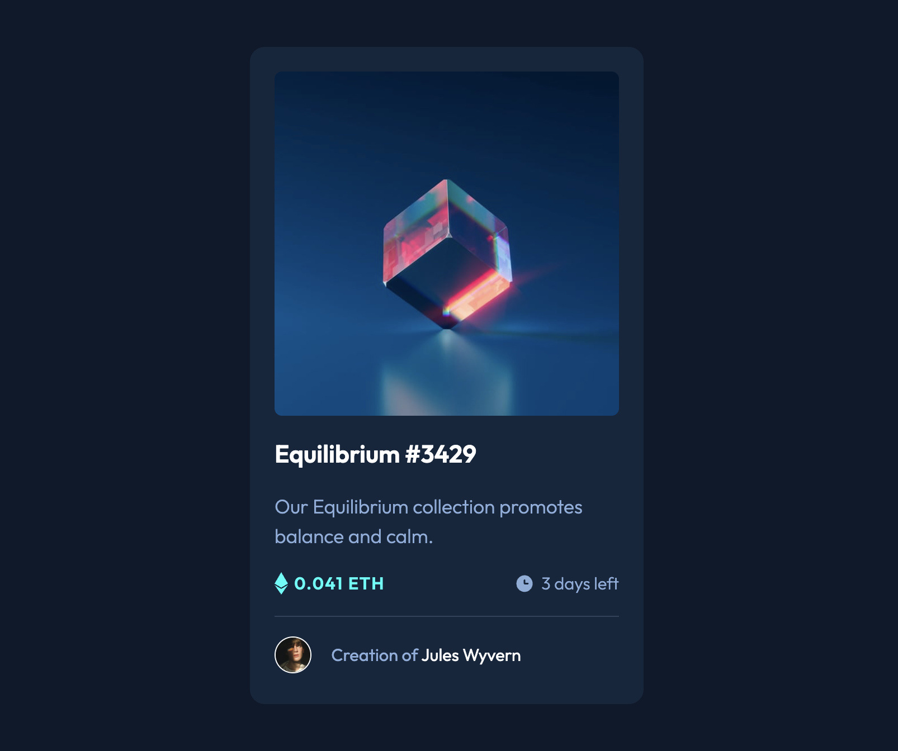

# Frontend Mentor - NFT preview card component solution

This is a solution to the [NFT preview card component challenge on Frontend Mentor](https://www.frontendmentor.io/challenges/nft-preview-card-component-SbdUL_w0U). Frontend Mentor challenges help you improve your coding skills by building realistic projects.

## Table of contents

- [Overview](#overview)
  - [Screenshot](#screenshot)
  - [Links](#links)
- [My process](#my-process)
  - [Built with](#built-with)
  - [What I learned](#what-i-learned)
  - [Continued development](#continued-development)
- [Author](#author)

## Overview

- Completed 2.24.23

### Screenshot



### Links

- Solution URL: [Add solution URL here](https://github.com/keblank/FEM_nft-preview-card)
- Live Site URL: [Add live site URL here](https://keblank.github.io/FEM_nft-preview-card/)

## My process

### Built with

- Semantic HTML5 markup
- SCSS
- Flexbox

### What I learned

- Image overlays
- Connecting SCSS file

```css
/* blue hover effect */
&--overlay {
  position: absolute;
  border-radius: 6px;
  top: 0;
  bottom: 0;
  left: 0;
  right: 0;
  height: 100%;
  width: 100%;
  opacity: 0;
  transition: 0.5s ease;
  background-color: hsla(178, 100%, 50%, 0.6);

  .icon-view {
    color: white;
    font-size: 20px;
    position: absolute;
    top: 50%;
    left: 50%;
    -webkit-transform: translate(-50%, -50%);
    -ms-transform: translate(-50%, -50%);
    transform: translate(-50%, -50%);
    text-align: center;
  }
}

&:hover .image__container--overlay {
  opacity: 1;
  cursor: pointer;
}
```

### Continued development

- Practice with SCSS

## Author

- Kells
